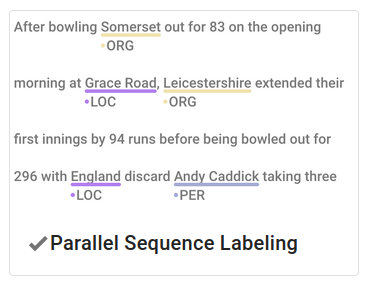
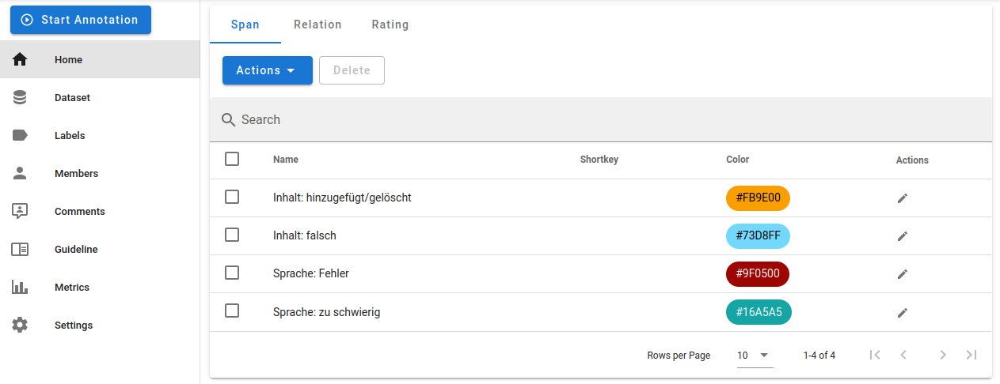
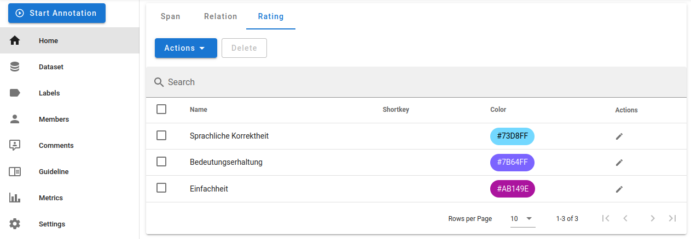

# Parallel annotation

This fork supports span annotation of parallel documents (annotating multiple texts at the same time) and Likert-style ratings.

## Setup

1. Create a project with the "Parallel Sequence Labeling" type:  
   
2. Define labels for span annotations and ratings in the "Labels" section of the settings:  
     
     
   Note that all span labels can be used on either of the parallel texts. There is currently no way to restrict a label to only be used on one of the two texts.
3. Import the dataset. It needs to be in the following format:  
   ```
   {"text": "[\"First text\", \"Second text\"]", "label": []}
   ```  
   The value of the `"text"` key is a JSON string of an array containing two (or more) strings. To generate this format in Python, do something like this:  
   ```python
   json.dumps({"text": json.dumps([text1, text2]), "label": []})
   ```

## Deployment

Docker images for production deployment are [available](https://hub.docker.com/r/saeub/doccano). To deploy with Docker Compose, use `docker/docker-compose.prod.yml`:

```bash
docker compose -f docker/docker-compose.prod.yml up
```
